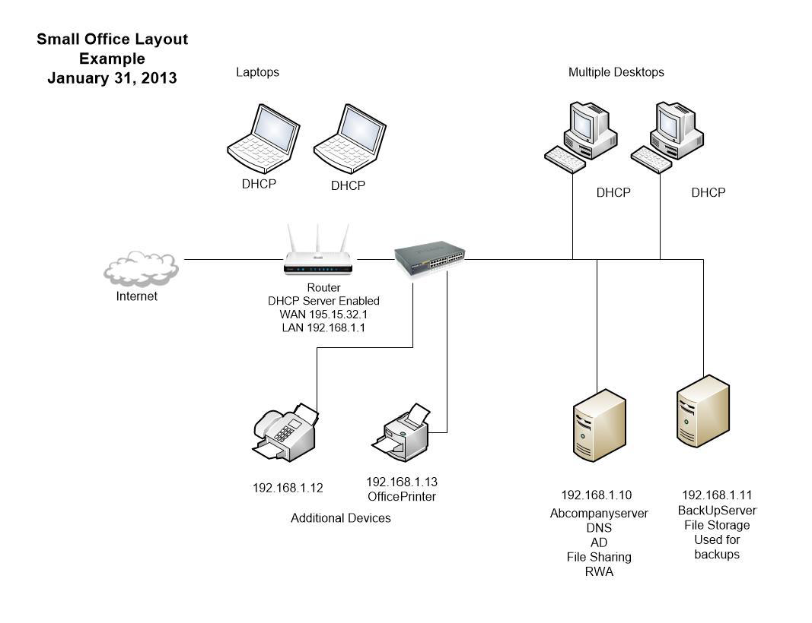

## Site Overview

Include information about the company, including type of business, how many employees and a general description of their systems.

### Site Contact Information

  + Main Contact: 
  + Organization: 
  + Email: 
  + Web: 
  + Address: 

----

### Domain Information

  + Domain Name:
  + Doman Provider:
  + Expiry:

### ISP Information

  + ISP Name: 
  + Account #: 
  + Username: 
  + Password: 
  + Inside IP Address: 
  + Outside IP Address: 
  + PPPoE Username: 
  + PPPoE Password: 
  + Connection Type: 
  + Modem Make: 
  + Modem Model: 

Notes: 

----

### Email Information

  + Email Provider: 
  + Email Method: 

  + Technical Support: 

  + Admin accounts:

#### Email Account Username and Passwords

|User |Email |Password |
|-----|------|---------|
|     |      |         |
|     |      |         |

#### Pop Setting

  + Server Name: 
  + Port: 
  + Encryption: 

#### IMAP Setting

  + Server Name: 
  + Port: 
  + Encryption: 

#### SMTP Setting

  + Server Name: 
  + Port: 
  + Encryption: 

----

### Server Information

  + Total Number of Servers: 
  + Server Name: 
  + Server Role: 
  + Server IP: 
  + Subnet Mask: 
  + Default Gateway: 
  + DNS: 
  + Server Make: 
  + Warranty Expiry: 
  + Server O/S: 
  + Admin Username: 
  + Password: 

Server Applications: 

#### Active Directory Username and Passwords

|Username |Password |Account Type|
|---------|---------|------------|
|         |         |            |
|         |         |            |

#### Workstations

|Computer Name |IP            |Primary User |Applications and Licenses|
|--------------|--------------|-------------|-------------------------|
|              |              |             |                         |
|              |              |             |                         |

----

### Backup Information

  + Backup Method: 
  + Online Portal: 
  + Username: 
  + Password: 
  + Backup Size: 
  + Backup Application: 
  + Strategy Description: 

Notes:

----

### Networking Information

  + Domain: 
  + Subnet: 

#### Router Information

  + Total Number of Routers:

#### Router #1

  + Router Model: 
  + Ports: 
  + Router IP: 
  + Router Username: 
  + Router Password: 
  + Wireless Security: WPA2
  + Wireless Key: 
  + Port fowarding: 
  + DHCP Range: 
  + Firewall Settings: 

#### Router #2

  + Router Model:
  + IP:
  + Router Username:
  + Router Password:
  + DHCP Server:
  + DHCP IP Scope:

Notes: 

----

### Switch Information

  + Total Number of Switches:

#### Switch #1

  + Switch Make: 
  + Ports: 
  + Username: 
  + Password: 
  + IP: 

#### Other Devices

  + Device Name: 
  + Device Type: 
  + Device Make: 
  + IP: 
  + Username: 
  + Password: 
  + Settings: 

Additional Details: 

  + Device Name: 
  + Device Type: 
  + Device Make: 
  + IP: 
  + Password: 
  + Settings: 

Additional Details: 

----

### Site Schematic

----

### Applications

  + Standard Workstation O/S: 
  + Standard Office Version: 
  + Anti-Virus: 

#### Miscellaneous Information

#### 3rd Party Applications

  + Configuration: 
  + Unique Setup: 
  + Required ports: 
  + Support Contact: 

Notes:

----

### Contacts

  + IT Support: 

  + Phones: 

  + Printers: 

  + ISP: 

  + Web Site Hosting: 

  + 3-rd Party Support:

